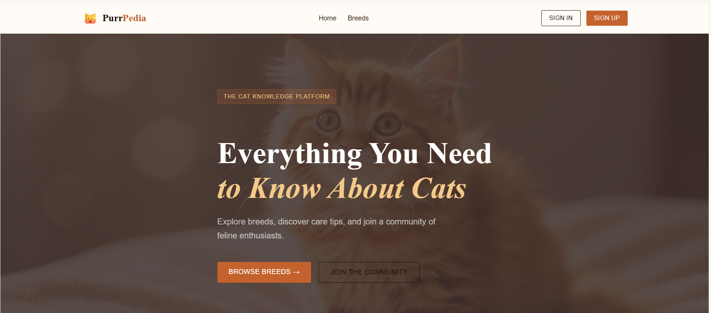
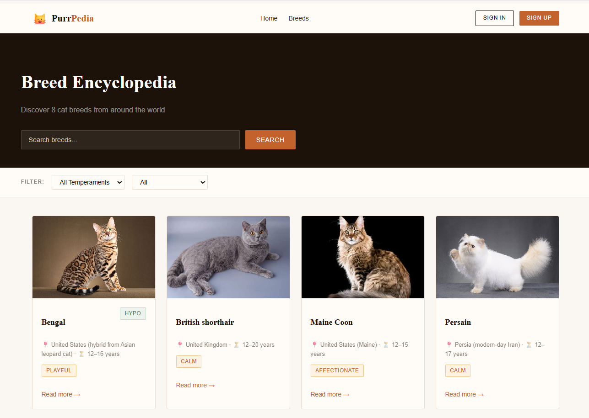
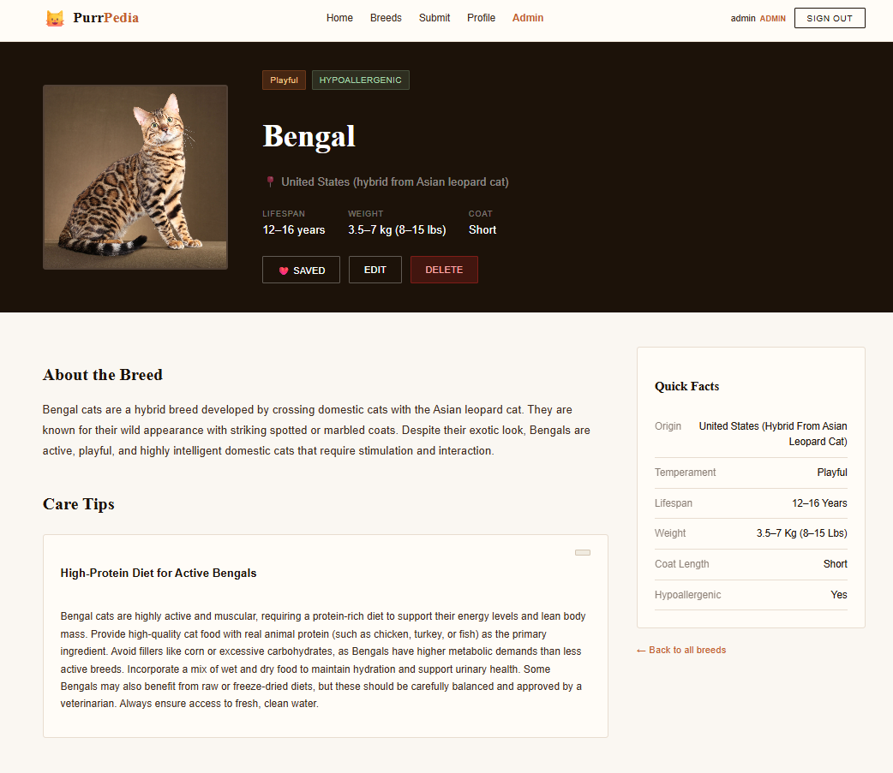

# 🐾 Purrpedia – Cat Breed Knowledge Platform

## 📌 Project Overview

Purrpedia is a web-based platform designed for cat lovers to explore, discover, and contribute cat-related knowledge such as cat breeds and care tips.

The system centralizes scattered cat information into a single, structured, and community-driven knowledge platform with moderation control to ensure content quality.

---

## 🏗 System Architecture Overview

**Architectural Style:** Layered Client–Server Architecture  
**Backend Design:** Modular Monolith (REST API)

### 🔹 Architecture Summary
- **Frontend (Client):** Next.js handles UI and user interaction  
- **Backend (Server):** Django + Django REST Framework handles business logic and data  
- **Communication:** REST API over HTTP (JSON + JWT authentication)  

### 🔹 Backend Modules
- `users` → authentication, profiles, roles  
- `breeds` → breed data and care tips  
- `submissions` → contribution workflow  

### 🔹 Layered Structure
- **Presentation Layer** → Frontend UI (Next.js)  
- **API Layer** → Django views (HTTP handling)  
- **Business Logic Layer** → services.py  
- **Data Layer** → Django ORM + SQLite  

---

## 👥 User Roles

### 1️⃣ Guest
- View public cat information
- Read-only access
- Cannot upload or edit content

### 2️⃣ Registered User
- Register / Login / Logout
- Manage personal profile
- Browse & search cat breeds and care tips
- Set preferences
- Receive personalized recommendations
- Create and edit own content
- Upload cat images
- Save favorite content

### 3️⃣ Admin
- Full system access
- Manage users
- Review and moderate submissions
- Approve / Reject / Edit / Delete content
- Perform all CRUD operations

---

## ✨ Core Features

### 🔐 Authentication & Authorization
- JWT-based authentication
- Secure login and logout
- Role-based access control

### 🐱 Cat Information Management
- Create, Read, Update, Delete (CRUD)
- Image upload support
- Structured cat breed and care content

### 📝 User Contribution System
- Wikipedia-style content submission
- Pending → Approved/Rejected workflow
- Admin moderation system

### 🎯 Personalized Recommendation
- Content suggestions based on user preferences
- Favorite content tracking

---

## 🔄 System Workflow

1. Guest visits platform and views public content
2. User registers or logs in
3. Registered user browses or submits content
4. New submissions are stored as **Pending**
5. Admin reviews submission
6. Approved content becomes publicly visible

---

## 🛠 Technology Stack

### Frontend
- Next.js 14 (React)
- TypeScript
- CSS (custom styling)
- React Context API (AuthContext)

### Backend
- Django 5
- Django REST Framework (DRF)
- Function-based API views

### Database
- SQLite (development)
- Designed for PostgreSQL migration

### Authentication
- JSON Web Token (JWT) via `djangorestframework-simplejwt`

---

## 🚀 Installation & Setup

### 1️⃣ Clone Repository

```bash
git clone https://github.com/your-username/purrpedia.git
cd purrpedia
```

### 2️⃣ Backend Setup (Django)

```bash
cd backend
python -m venv venv
venv\Scripts\activate   # Windows
# source venv/bin/activate  # macOS/Linux

pip install -r requirements.txt
```

Run migrations:

```bash
python manage.py migrate
```

Create admin account:

```bash
python manage.py createsuperuser
```

Run Backend:

```bash
python manage.py runserver
```

Backend runs at: http://127.0.0.1:8000

### 3️⃣ Frontend Setup (Next.js)

```bash
cd frontend
npm install
npm run dev
```

Frontend runs at: http://localhost:3000


---

## ▶️ How to Run the System

1. Start backend server:

```bash
python manage.py runserver
```

2. Start frontend:

```bash
npm run dev
```

3. Open browser:

```bash
http://localhost:3000
```
4. Register or log in

5. Use admin account for moderation features

---

## 📸 Screenshots







---

## ❌ Out of Scope 
- AI-based image recognition 
- Online pet adoption system 
- E-commerce payment integration 
- Veterinary medical diagnosis system

---

## 👤 Created By

**6510545276** – Kantapon Hemmadhun  